# 🕵️‍♀️ Healthcare Fraud Detection Using Graph Analysis and AI 🤖

> **🎯 Purpose:**  
> This repository contains my project for the UCD Professional Academy - Machine Learning Certificate course curriculam. We developed an innovative approach to detect healthcare fraud by leveraging **graph analysis** and **machine learning** techniques. 

> **🎯 Solution Goal:**  
> The goal is to improve detection accuracy, transparency, and investigation efficiency in healthcare systems in Ireland.

> **🚦 Solution Scope:**  
> This analysis aims to detect healthcare fraud by identifying suspicious claims, providers, and patient patterns. It employs machine learning models like Isolation Forest and Random Forest to flag anomalies, high claim volumes, and abnormal claim amounts. Network analysis visualizes potential collusion, while feature engineering highlights key indicators of fraudulent activity. The goal is to enable early detection of high-risk entities, streamline investigations, and improve fraud prevention efforts, ultimately safeguarding healthcare resources and ensuring system integrity.

> **📊 DataSet Use:**
> Since there is no readily available dataset that could support the real-world dataset of healthcare systems in ireland, I have used Synthea Patient Generator - International version to generate datasets specific to few demographics in ireland such as Galway, Dublin and Limerick as cities with list of Patients, Providers, Claims, Claims_Transactions etc. 

> **📊 Summary of results**  
> The results conclude the following can be identified during normal claims processing and can be integrated into business operations for further action:  
> - 💰 High claim amounts and frequent claims flagged as potential fraud.  
> - 🔍 Outlier claims identified via anomaly detection.  
> - 🌐 Network analysis reveals clusters of providers and patients with suspicious interactions.  

# 📚 Table of Contents

- [Introduction](#-introduction)
  - [About Healthcare Fraud, Waste, and Abuse (FWA)](#-about-healthcare-fraud-waste-and-abuse-fwa)
  - [Why Does this Matter?](#-why-does-this-matter)
- [Analysis & Techniques for FWA Detection](#-analysis--techniques-for-fwa-detection)
  - [Understanding FWA Concepts](#-understanding-fwa-concepts)
  - [Techniques & Code](#-techniques--code)
  - [Solution Scope](#solution-scope)
- [Getting Started](#-getting-started)
  - [The Notebooks](#-the-notebooks)
  - [Directory Structure](#-directory-structure)
  - [Datasets](#-datasets)
  - [Libraries Used](#-libraries-used)
  - [Prerequisites](#-prerequisites)
  - [Clone the Repo](#clone-the-repo)
  - [Set Up Environment](#set-up-environment)
  - [Running the Notebooks](#-running-notebooks)
  - [Running the Notebooks in GCP | Vertext AI](#running-the-notebooks)
- [Analysis Workflow](#-analysis-process)
  - [Data Loading and Preprocessing](#data-loading-and-preprocessing)
  - [Data Merging](#data-merging)
  - [Exploratory Data Analysis (EDA)](#exploratory-data-analysis-eda)
    - [Patients Demographics](#patients-demographics)
    - [Claims Overview](#claims-overview)
    - [Provider Analysis](#provider-analysis)
  - [Feature Engineering & Suspicious Pattern Detection](#feature-engineering--suspicious-pattern-detection)
  - [Concepts and Techniques Used](#concepts-and-techniques-used)
  - [Findings & Next Steps](#findings--next-steps)
  - [Final Notes](#final-notes)
- [References & Resources](#-references--resources)
- [Authors & Acknowledgments](#-authors--acknowledgments)
- [License](#-license)

---

## 🌟 Introduction

This project analyses healthcare claims data to identify potential **fraud** patterns. Using synthetic datasets generated via **Synthea**, we perform exploratory data analysis, feature engineering, anomaly detection, and visualization to uncover suspicious behaviors from patient, provider, and claims perspectives.

### 🏥 About Healthcare Fraud, Waste, and Abuse (FWA)  
Fraud, Waste, and Abuse (FWA) in healthcare represent significant challenges worldwide, leading to billions of euros in unnecessary costs annually. Specifically, in Ireland and across the European Union, healthcare systems are under increasing pressure to optimize resources while maintaining high standards of care.

- **Fraud** involves intentional deception or misrepresentation for financial gain, such as falsifying claims or identities.  
- **Waste** refers to overutilization or inefficient practices that increase costs without improving patient outcomes.  
- **Abuse** includes practices like upcoding, billing for services not rendered, or unbundling procedures to inflate charges.

> **Note:**  
> The scope of this project is to focus on detecting fraudulent activity or suspicious relationships between healthcare actors such as providers, patients, pharmacies.  

### 💡 Why does this matter?  

- According to the European Healthcare Fraud and Corruption Network (EHFCN), EU member states lose an estimated **€56 billion annually** due to healthcare fraud and abuse. [Source](https://www.ehfcn.eu/)  
- In Ireland, the Health Service Executive (HSE) estimates that **up to 10%** of healthcare expenditure may be attributable to fraud, waste, or abuse, translating into hundreds of millions of euros annually.  
- The **World Bank** reports that health sector fraud costs can account for **up to 3-5%** of total health expenditures in developed countries.

Effective fraud detection helps prevent financial losses, addresses inefficiencies and compliance risks, and rises in the cost of care. This project leverages data analysis and machine learning techniques to identify suspicious claims and activities in synthetic Irish healthcare data.

---

## 🔬 Analysis & Techniques for FWA Detection
### 1. Understanding FWA Concepts
| Concept | Explanation | Indicator | Formula / Metric | Interpretation |
|---------|------------------------------------------|-------------------------------------------|------------------------------|------------------------------------------|
| **Fraud** ✅ | Intentional deception for financial gain | Claims with false info or staging | False claims, identity theft | Excessive claims, suspicious patterns |
| **Waste** 🚫 | Overutilization or misuse of resources | Excessive billing, unnecessary procedures | Cost per patient/provider | High expenses with no added value |
| **Abuse** 🚫 | Improper billing practices | Upcoding, unbundling | Billing codes misuse | Discrepancies between services and codes |

### 2. Techniques & Code
- **Outlier Detection** (e.g., Isolation Forest)  
  - **Purpose:** Automatically flag claims that deviate significantly from normal patterns.  
  - **Formula / Concept:** Isolation Forest isolates anomalies by randomly partitioning the data space. Fewer splits to isolate a point suggest an anomaly.  
  - **Interpretation:** Claims flagged as -1 are potential frauds or anomalies needing manual review.  
- **Threshold-based Flagging:**  
  - **Purpose:** Identifies claims exceeding set thresholds for amount or frequency, that would require potential review.   
- **Visualization & Network Analysis:**  
  - **Purpose:** This reveals clusters of suspicious providers and patients, that would require potential review.

---

## 🏁 Getting Started

### 📚 The Notebooks

The repository includes three main notebooks:  
- `healthcare_fwa_analysis.ipynb` — General FWA analysis with visualizations.  
- `healthcare_fwa_graph_analysis.ipynb` — Graph-based ML approach inspired by research papers.  
- `healthcare_fwa_opt2_analysis.ipynb` — Machine learning to detect suspicious claims.

### 🗂️ Directory Structure
```plaintext
.
├── notebooks/
│   ├── healthcare_fwa_analysis.ipynb
│   ├── healthcare_fwa_graph_analysis.ipynb
│   └── healthcare_fwa_opt2_analysis.ipynb
├── data/
│   └── sample_data/
│       └── csv/
│           └── [county specific folders]
├── containers/
│   ├── Dockerfile
│   └── other configs
├── requirements.txt
├── LICENSE.md
└── README.md
```

### 📊 Datasets
This project utilizes a **synthetic healthcare dataset** generated through the **Synthea** tool. Synthea is an open-source simulator designed to produce realistic, anonymized patient records based on population models. This approach enables scalable and privacy-preserving research and analysis. Synthea generates wide set of datasets specific to whole heatlhcare domain context out of which we are only using claims.csv, claim_transactions.csv, providers.csv, patients.csv etc, rest of the files are moved from the github repository to avoid excessive storage billing. 

> **INFO:**  
> Due to limited and insufficient data available from HSE and broader European sources, we opted to use synthetic data generated via Synthea. This allows us to create a comprehensive, realistic dataset that includes diverse patient profiles, claims, and healthcare scenarios necessary for effective fraud detection analysis. Using synthetic data ensures data privacy, enables scalable testing, and provides the detailed information required to develop and validate robust fraud detection models in a controlled environment.

#### Why Use Synthetic Data?

- **Privacy & Confidentiality:** Synthetic data circumvents privacy concerns associated with real patient records.
- **Controlled Environment:** Facilitates testing, experimentation, and validation without risking sensitive information.
- **Resource Efficiency:** Eliminates the need for complex data access procedures and compliance hurdles.
- **Customizability:** Data can be tailored to specific scenarios, demographic distributions, or rare conditions, enhancing research flexibility.

The datasets used include:

- **Patients Data (patients.csv):** Demographics, medical history, and socioeconomic info.
- **Claims Data (claims.csv):** Claims details such as amount, date, diagnoses, and provider.
- **Claims Transactions (claims_transactions.csv):** Detailed transaction info linked to claims.
- **Providers Data (providers.csv):** Provider specialties, locations, and contact info.

The datasets are synthetically generated and stored in CSV format, providing a realistic basis for analysis.

The datasets are stored in the following directory structure (within the repo):

```
data/
└── sample_data/
    └── csv/
        └── [county-specific folders]/
            └── *.csv
```
> Each folder contains CSV files specific to a county. (for e.g: galway, limerick, dublin, cork) 

> **Warning:**
Using Synthea-generated synthetic datasets enables safe and flexible healthcare data analysis. However, it is crucial to understand and account for the inherent biases to ensure meaningful and responsible insights.

### Libraries Used 📚

| Library | Purpose |
| -------- | ------- |
| `scikit-learn` 🧠 | ML algorithms (Random Forest, Isolation Forest) + evaluation tools |
| `pandas` 🐼 | Data handling & manipulation |
| `matplotlib` / `plt` 🎨 | Static visualizations (charts, distributions) |
| `seaborn` 📊 | Enhanced statistical plots (correlation, importance) |
| `plotly.express` 🌐 | Interactive dashboards & visual analytics |
| `sklearn.inspection` 🔍 | Model interpretability (partial dependence) |
| `numpy` ⚙️ | Numerical operations & array management |

### Prerequisites ✅

Ensure you have the following installed:
- Python 3.8+ environment
- Git & Git LFS
- Jupyter Notebook (or compatible IDE)
- Packages from `requirements.txt`:

```bash
pip install -r requirements.txt
```

#### Required Python packages:
Install the following packages within jupyter notebooks or python code.
```bash
pip install pandas numpy matplotlib seaborn plotly scikit-learn
```

### Clone the repo 🛰️
```bash
git clone https://github.com/nithinmohantk/ucdpa-ml-capstone-project-healthcare-fraud-detection-ireland.git
cd ucdpa-ml-capstone-project-healthcare-fraud-detection-ireland
```

### Large Files and Git LFS 📦

This repository uses [Git Large File Storage (LFS)](https://git-lfs.github.com/) for managing large files such as datasets and models. When cloning this repository, ensure that you have Git LFS installed and initialized on your system to fetch these files properly.

**To install Git LFS:**

```bash
# For most systems
git lfs install
```

### After cloning the repository, run:
```bash
git lfs pull
```

### Set Up Environment ⚙️
#### Using Docker 🐳
To build and run the container:
```bash
docker build -t irl-healthcare-fwa .
docker run -p 8888:8888 -v "$(pwd):/app" irl-healthcare-fwa
```

This will start Jupyter Notebook server accessible at http://localhost:8888.

#### Manual Setup
Alternatively, set up a Python environment:

```bash
pip install -r requirements.txt
```

### Run Notebooks 📒

Launch Jupyter Notebook in project directory:
```bash
jupyter notebook
```
- Open the notebooks in the notebooks/ directory:

- Initial Data Analysis & Visualizations: `healthcare_fwa_analysis.ipynb`

- Graph-Based ML Analysis: `healthcare_fwa_graph_analysis.ipynb`

- ML-based Detection Algorithm: `healthcare_fwa_opt2_analysis.ipynb`

> **Note**
Update dataset paths if necessary to point to your local data folders.

### OR - Running Notebooks on Google Cloud Vertex AI Workbench

For a seamless experience and enhanced computational resources, we recommend running these notebooks within [Google Cloud Vertex AI Workbench](https://cloud.google.com/vertex-ai/docs/workbench). This managed environment simplifies setup, scales easily, and provides powerful GPUs/TPUs for large-scale data processing.

#### Getting Started in Vertex AI Workbench

1. **Create a Vertex AI Workbench Notebook Instance**: Follow the [Google Cloud documentation](https://cloud.google.com/vertex-ai/docs/workbench/use-notebooks) to set up a Managed Notebook environment.
2. **Clone the Repository**: Use Git within the notebook to clone this repository or upload files directly.
3. **Configure Environment**: Install necessary dependencies, either via `requirements.txt` or conda environments.
4. **Open and Run Notebooks**: Launch the notebooks directly from the Vertex AI interface.

#### Visual Guidance (Screenshots)
*Below are some reference screenshots illustrating the setup process and interface:*

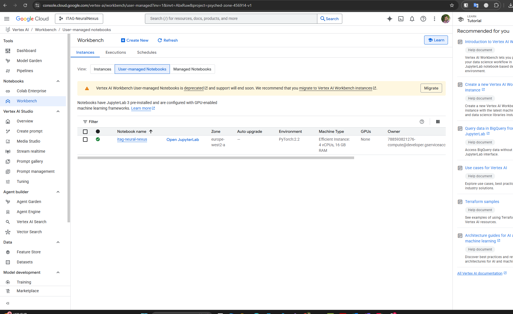  
*Fig 1: Vertex AI Workspace Dashboard*

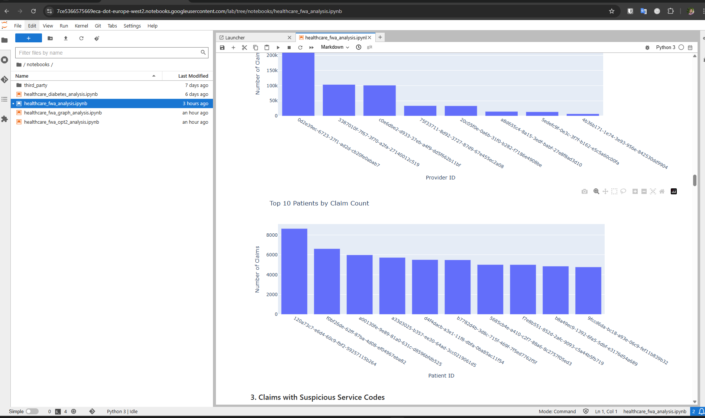  
*Fig 2: Opening and running notebooks within the environment*

## Analysis Workflow 🔍

Here we are trying to document the few high level steps involved in processing the data. 

### Data Loading and Preprocessing

```bash
import pandas as pd

patients_df = pd.read_csv('path/to/patients.csv')
claims_df = pd.read_csv('path/to/claims.csv')
transactions_df = pd.read_csv('path/to/claims_transactions.csv')
providers_df = pd.read_csv('path/to/providers.csv')

# Convert date columns to datetime
patients_df['BIRTHDATE'] = pd.to_datetime(patients_df['BIRTHDATE'], errors='coerce')
claims_df['SERVICEDATE'] = pd.to_datetime(claims_df['SERVICEDATE'], errors='coerce')
transactions_df['FROMDATE'] = pd.to_datetime(transactions_df['FROMDATE'], errors='coerce')
transactions_df['TODATE'] = pd.to_datetime(transactions_df['TODATE'], errors='coerce')
```

### Data Merging

```bash
    # Merge
    merged_df = claims_df.merge(transactions_df, on='CLAIMID', how='left')
```


### Exploratory Data Analysis (EDA)

#### 1. Patients Demographics
##### 1.1 Distribution of Gender
```python
import seaborn as sns
import matplotlib.pyplot as plt

sns.countplot(data=patients_df, x='GENDER')
plt.title('Patient Gender Distribution')
plt.show()
```

##### 1.2 Age Calculation
```python
import datetime as dt
today = dt.date.today()
patients_df['AGE'] = patients_df['BIRTHDATE'].apply(lambda x: today.year - x.year - ((today.month, today.day) < (x.month, x.day)))
sns.histplot(patients_df['AGE'], bins=20)
plt.title('Patient Age Distribution')
plt.show()
```
##### 1.3 Claims Overview

```python
# Claim amount distribution
sns.boxplot(x=merged_df['AMOUNT'])
plt.title('Claim Amounts')
plt.show()

# Claims over Time
merged_df['SERVICEDATE'].hist(bins=30)
plt.title('Claims Over Time')
plt.show()
```

#### 1.4 Provider Analysis

```python
# Top providers by number of claims
provider_claim_counts = merged_df['PROVIDERID'].value_counts().head(10)
provider_claim_counts.plot(kind='bar')
plt.ylabel('Number of Claims')
plt.title('Top 10 Providers by Claim Count')
plt.show()
```

### Feature Engineering & Suspicious Pattern Detection


##### 1. Identify High-Value Claims

```python
high_claim_threshold = merged_df['AMOUNT'].quantile(0.99)
suspicious_claims = merged_df[merged_df['AMOUNT'] > high_claim_threshold]
```

##### 2. Detect Repetitive & Rapid Claims
```python
merged_df['DATE'] = merged_df['SERVICEDATE'].dt.date
claims_per_provider_day = claims_df.groupby(['PROVIDERID', 'DATE']).size()
suspicious_frequency = claims_per_provider_day[claims_per_provider_day > 10]
```
##### 3. Anomaly Detection with Isolation Forest

```python
from sklearn.ensemble import IsolationForest
import numpy as np

# Prepare features
features = merged_df[['AMOUNT']]
features.fillna(0, inplace=True

clf = IsolationForest(contamination=0.01, random_state=42)
merged_df['anomaly_score'] = clf.fit_predict(features)

# Filter suspected fraudulent claims
suspects = merged_df[merged_df['anomaly_score'] == -1]
```
#### Visualization of Suspicious Activities

```python
import networkx as nx

G = nx.Graph()
for _, row in suspects.iterrows():
    G.add_node(row['PROVIDERID'], type='provider')
    G.add_node(row['PATIENTID'], type='patient')
    G.add_edge(row['PROVIDERID'], row['PATIENTID'])

nx.draw(G, with_labels=True)
plt.title('Suspected Provider-Patient Network')
plt.show()
```

### 💡 Concepts and Techniques Used

The analysis techniques implemented are specifically designed to identify fraudulent activities within healthcare claims:

- **Suspicious Claim Amounts:** Flagging claims with abnormally high amounts or units that are unlikely to be legitimate.
- **Unusual Claim Frequency:** Detecting providers or patients with an unusually high number of claims, indicating potential overutilization or collusive behavior.
- **Suspicious Service Codes:** Identifying claims associated with known or potentially fraudulent procedure codes.
- **Rapid Claim Submissions:** Highlighting providers submitting multiple claims within short timeframes, a pattern often associated with fraud rings.
- **Anomaly Scores from Machine Learning:** Utilizing algorithms like Isolation Forest and Random Forest to detect claims that significantly deviate from standard patterns, flagging them as potential fraud cases.
- **Network and Graph Analysis:** Revealing organized collusion or fraud rings by visualizing suspicious provider-patient relationships.

These methods collectively enhance the ability to detect, prioritize, and investigate fraudulent activities efficiently, helping to reduce financial losses and protect the integrity of healthcare systems.

### 📝 Findings & Next Steps
> High claim amounts and frequent claims flagged as potential fraud.

> Outlier claims identified via anomaly detection.

> Network analysis reveals clusters of providers and patients with suspicious interactions.

> Next steps include integrating supervised learning models with labeled data, refining feature sets, and developing dashboards for ongoing monitoring.

### 🎯 Final Notes
> This analysis serves as an initial screening tool.

> False positives are possible; manual review is essential.

> Models should be continuously updated with new data and feedback.

## 📸 Visual Summary
The following images illustrate the key findings from our analysis. These visualizations highlight suspicious patterns, network interactions, outlier claims, and other relevant metrics identified during our investigation. The results demonstrate the effectiveness of our graph-based and machine learning approaches in flagging potential healthcare fraud. Review the images below to gain insights into the detected anomalies and the overall performance of our detection techniques.

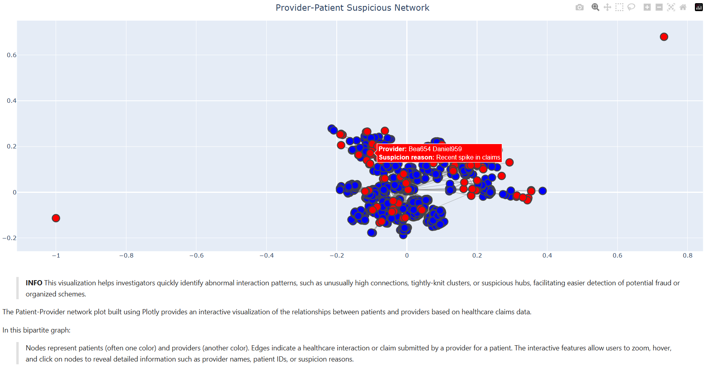
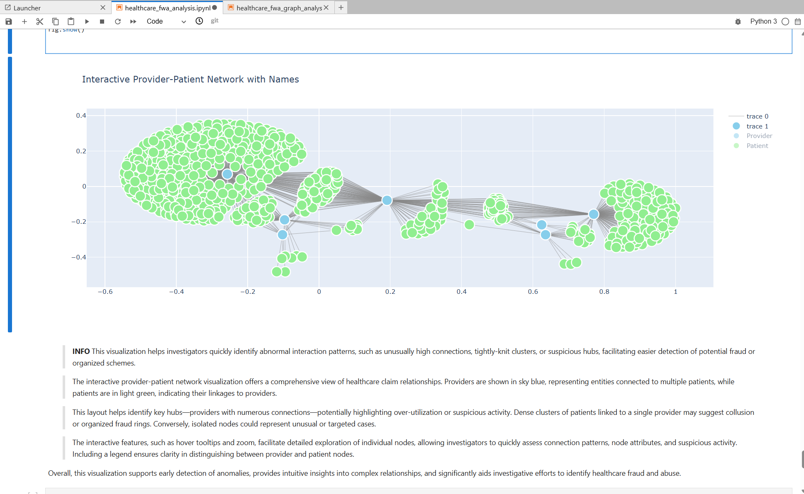
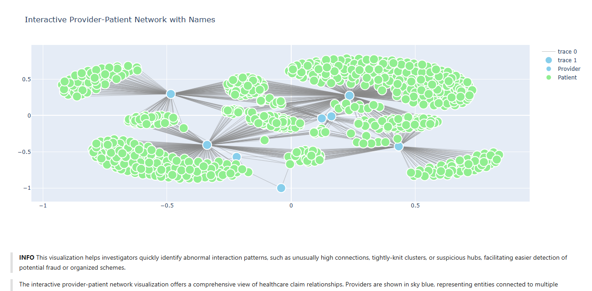
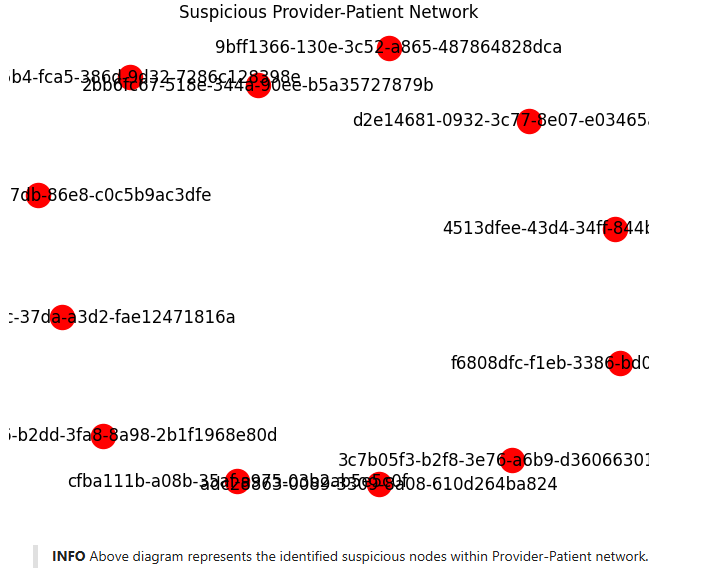
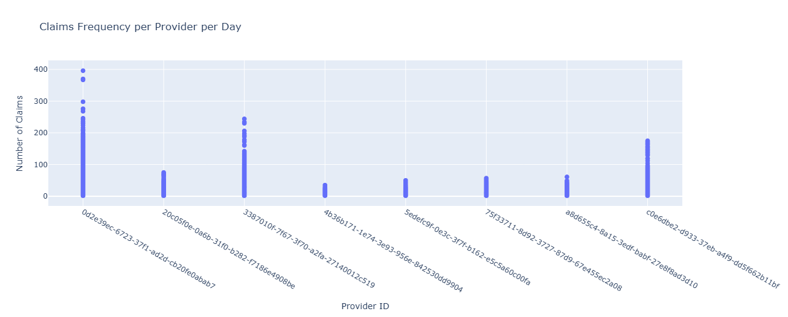
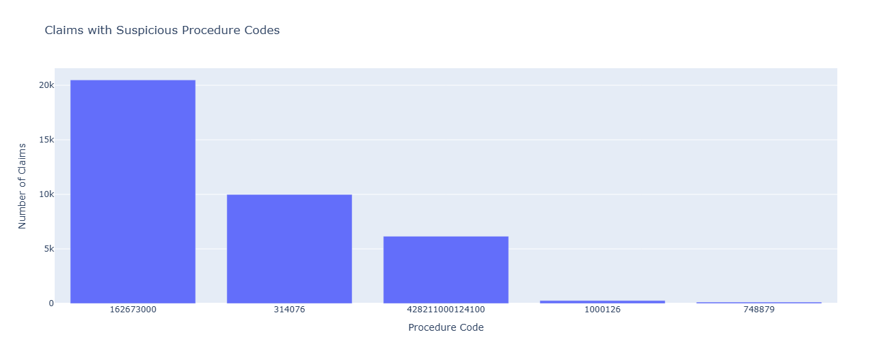
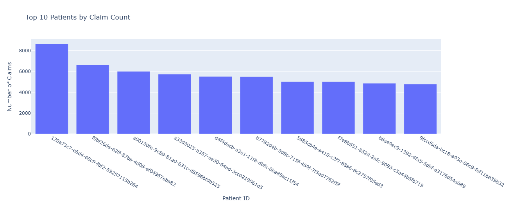
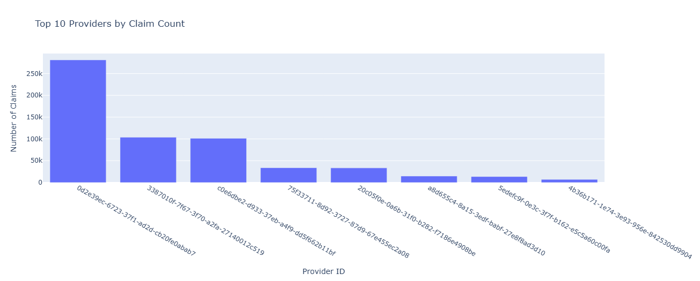
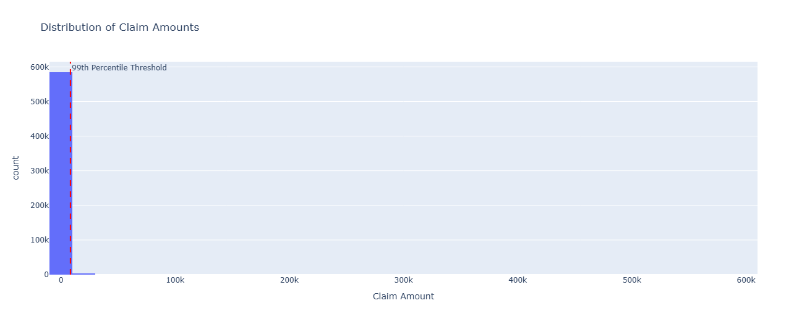

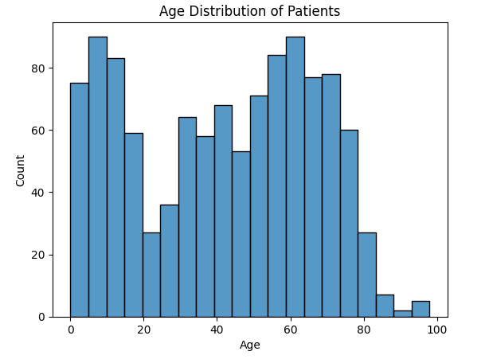
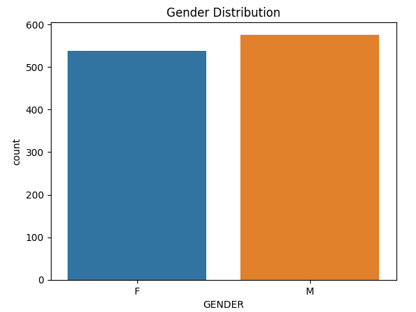
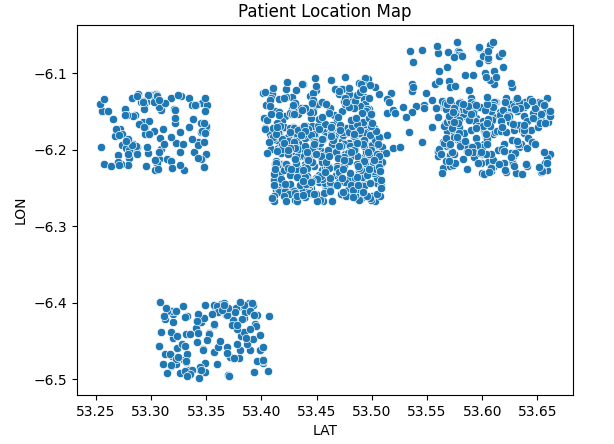
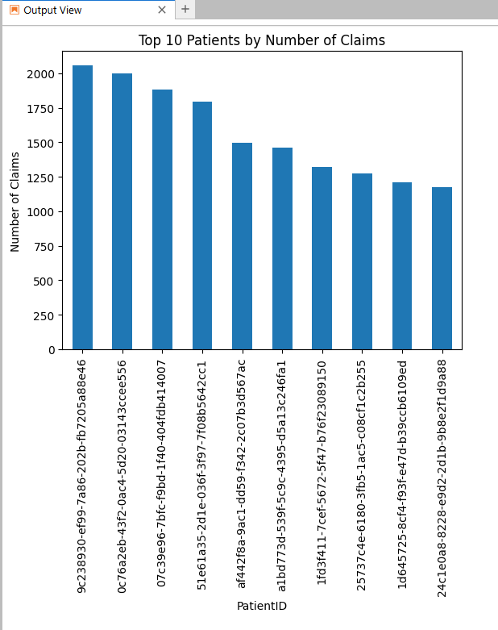
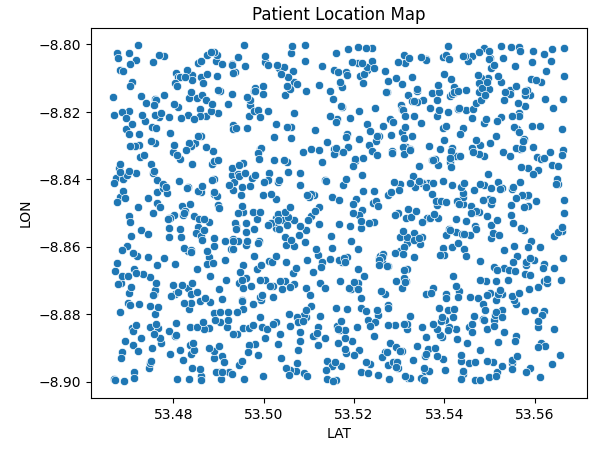


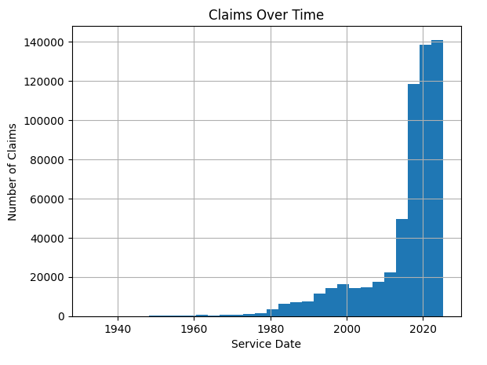
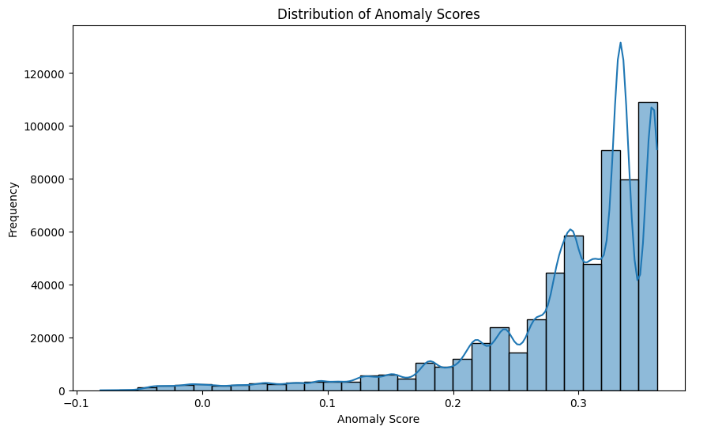
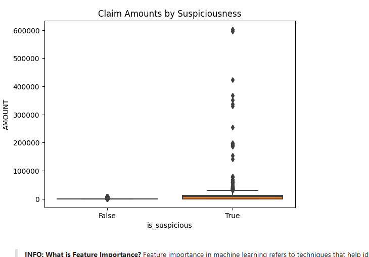
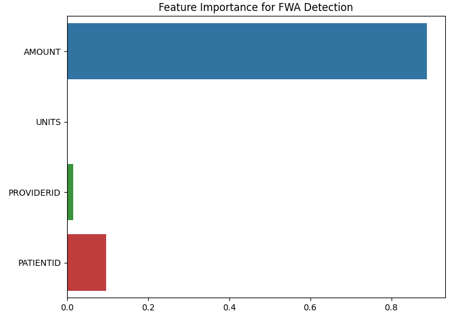
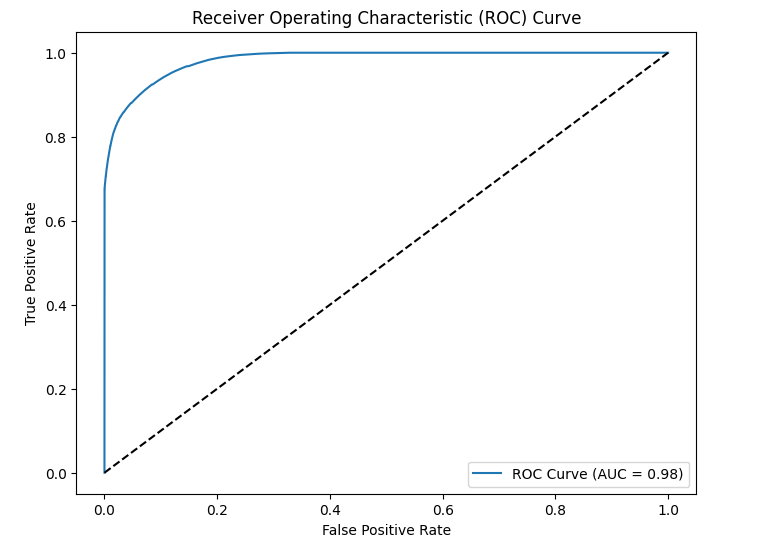
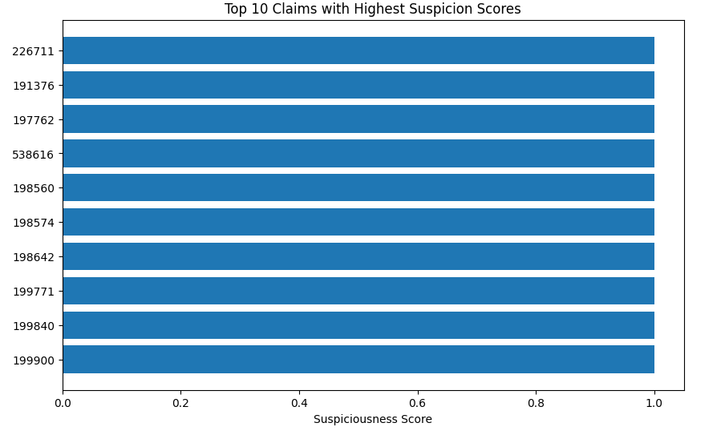


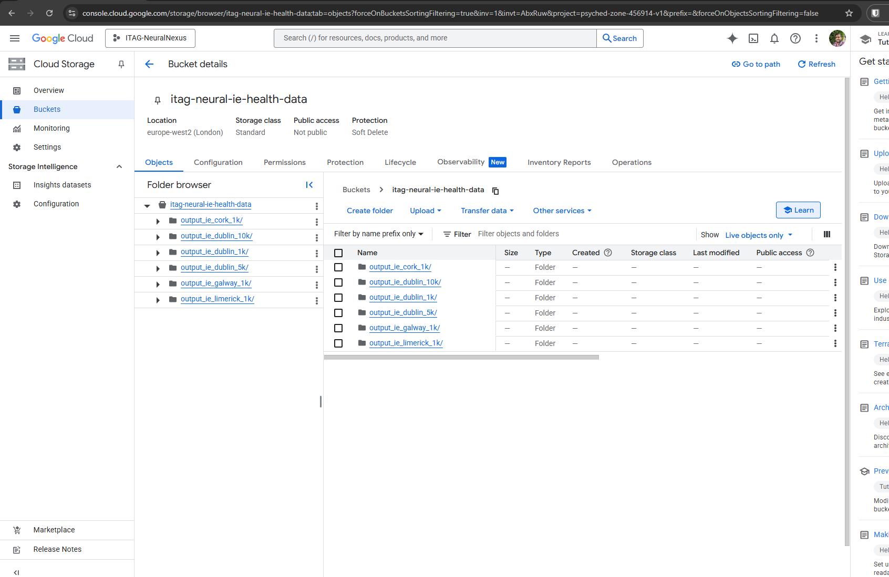

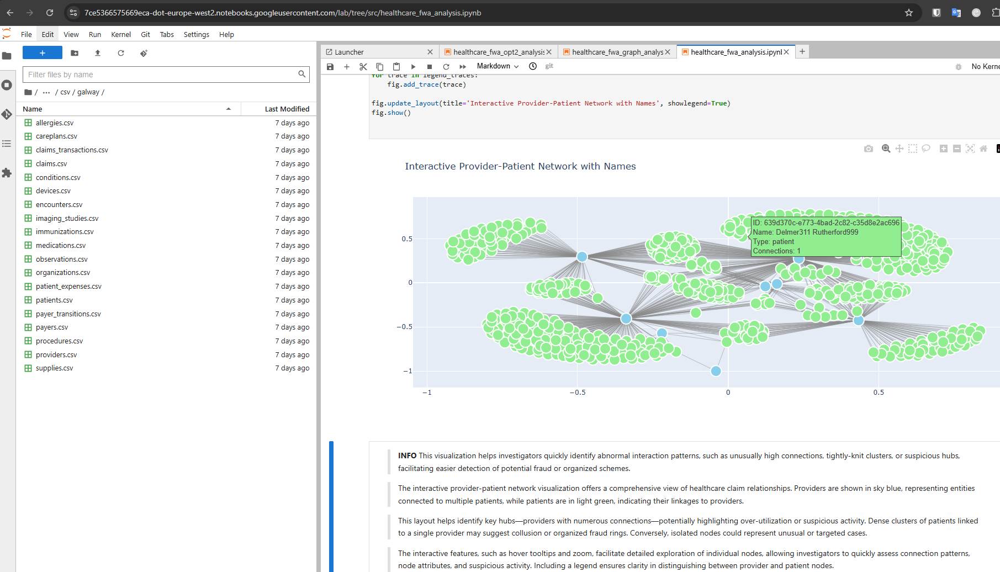
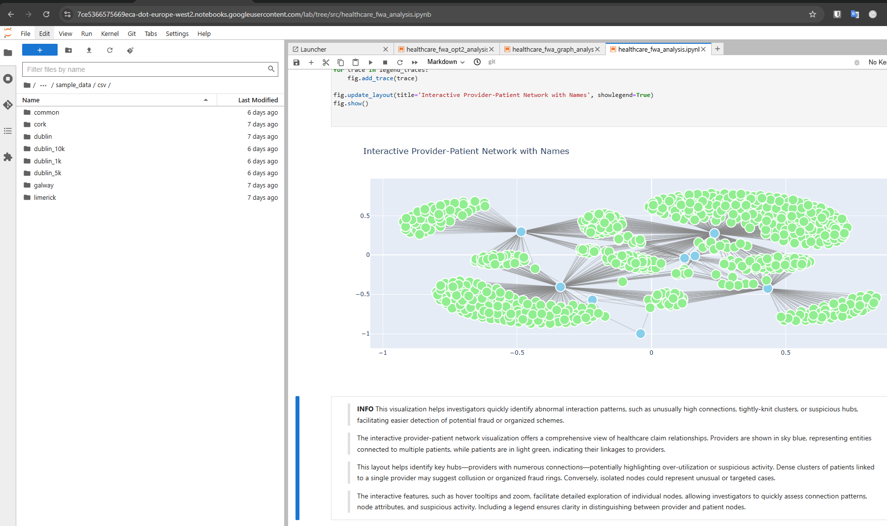

## 🔗 References & Resources
- **Synthea:** Synthetic Healthcare Data Generation
    - Main GitHub repo: https://github.com/synthetichealth/synthea
    - International extension: https://github.com/synthetichealth/synthea-international
- Generating Data for Ireland (IE):
    - Synthea can be customized for Ireland’s healthcare systems, demographics, and coding standards.
- See **README.md** on respective repo for for setup instructions.
- Documentation & Code: Synthea documentation: https://github.com/synthetichealth/synthea/wiki

## ⚠️ AI-Enhanced Content Notice
> **WARNING**
Please note that some content in this repository, including explanations, summaries, and documentation, has been generated or enhanced using AI tools to improve clarity and detail. Users should review and validate these sections as needed.*

## 🙌 Authors & Acknowledgments
- Nithin Mohan T K- [@nithinmohantk](https://github.com/nithinmohantk)
- Inspiration from [Research Paper - Graph Analysis for Detecting Fraud, Waste, and Abuse in Healthcare Data](https://ojs.aaai.org/aimagazine/index.php/aimagazine/article/view/2630/2554) by <i>Juan Liu, Eric Bier, Aaron Wilson, Tomo Honda, Sricharan Kumar,
Leilani Gilpin, John Guerra-Gomez and Daniel Davies - Palo Alto Research Center</i>

## 📜 License
This project is licensed under the MIT License. See the LICENSE file for details.

**© Nithin Mohan T K** - feel free to contribute and share.

> With love for healthcare data analysis and fraud detection.


